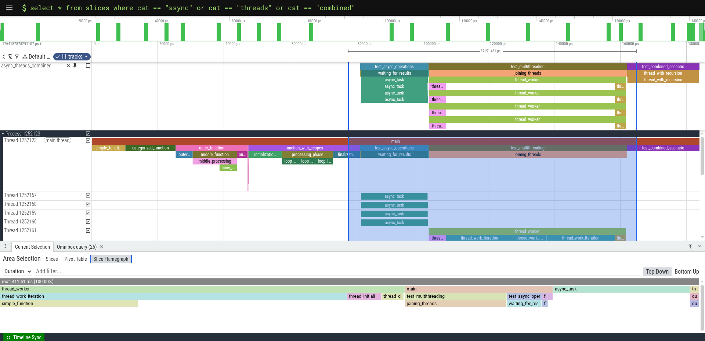
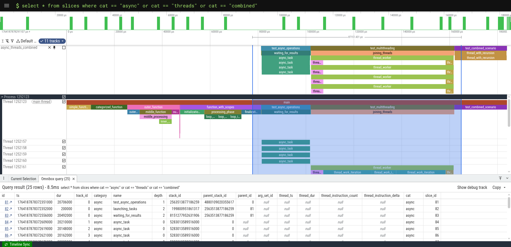
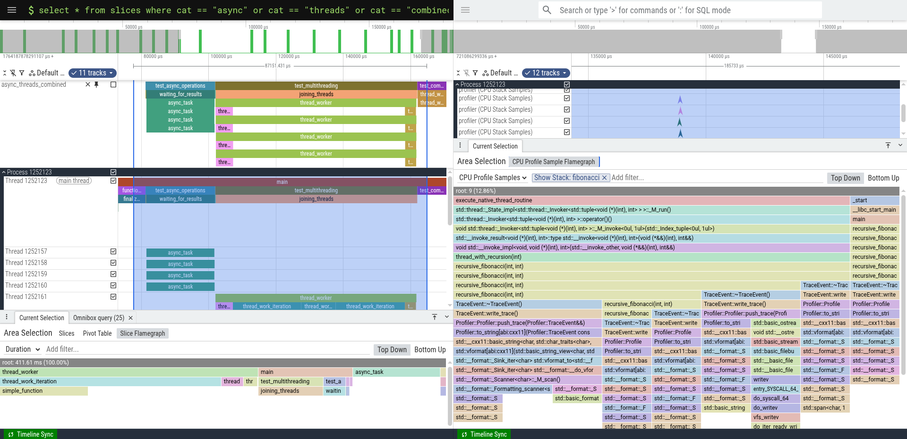
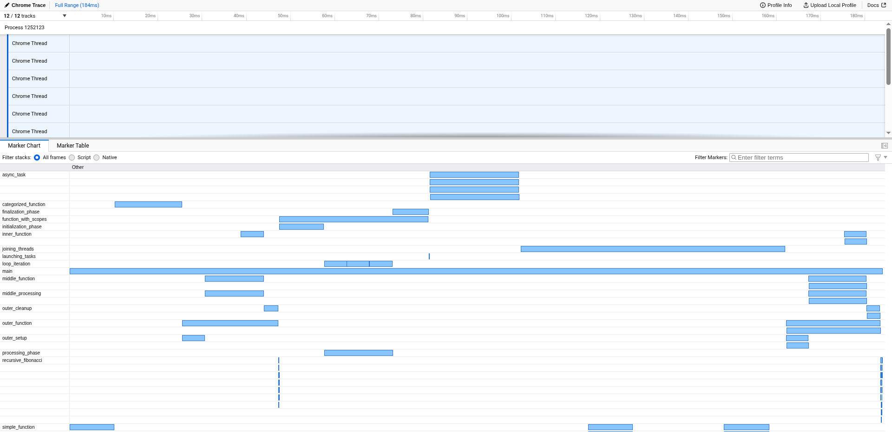

# Tracer

Lightweight profiler that generates Chrome Trace Event Format traces for visualization in Perfetto and Firefox Profiler.

## Features

- Zero-overhead when disabled via `#ifdef ENABLE_TRACING`
- Thread-safe with automatic thread ID tracking
- RAII-based scope tracing
- Chrome Trace Event Format (JSON) output
- Compatible with [Perfetto](https://ui.perfetto.dev) and [Firefox Profiler](https://profiler.firefox.com)

## Requirements

The project has different C++ standard requirements for different components.

- Client-side requires C++17 support for compiling but headers are linkable from C++14 code.
- Server-side requires C++23 support.

## Quick Start

### File-Based Tracing

Direct file output for simple use cases:

```cpp
#define ENABLE_TRACING
#include <src/Profiler/macros.hpp>

std::future<int> async_computation(int value)
{
    TRACE_FN_CAT("async");
    return std::async(std::launch::async, [value]() {
        TRACE_SCOPE_CAT("async_task", "async");
        std::this_thread::sleep_for(std::chrono::milliseconds(20));
        return value * 2;
    });
}

int main() {
    // Initialize profiler with output file
    TRACE_SETUP("trace.json");

    // Trace entire function
    TRACE_FN();
    {
        // Trace specific scope
        TRACE_SCOPE("initialization");
    }
    {
        // Trace with custom category
        TRACE_SCOPE_CAT("computation");
    }

    return 0;
}
```

### IPC-Based Tracing

Send traces to a TraceCollector server via named pipe for multi-process applications:

```cpp
#define ENABLE_TRACING
#include <src/Profiler/macros.hpp>

void process_data()
{
    IPC_TRACE_FN_CAT("computation");
    // Your code here
}

int main() {
    // Connect to TraceCollector server
    IPC_TRACE_SETUP("/tmp/tracer.pipe");

    // Trace entire function
    IPC_TRACE_FN();
    {
        // Trace specific scope
        IPC_TRACE_SCOPE("initialization");
    }
    {
        // Trace with custom category
        IPC_TRACE_SCOPE_CAT("computation", "processing");
    }

    return 0;
}
```

## TraceCollector Server

The TraceCollector is a standalone server that receives traces from multiple client processes via
IPC and writes them to a single output file. This is ideal for multi-process applications or when
you want to centralize trace collection.

### Usage

Start the TraceCollector server before launching your traced applications. The server automatically
handles multiple client processes and aggregates their traces into a single file:

```bash
./trace_collector [OPTIONS]
```

### Parameters

| Parameter         | Description                                  | Default            |
| ----------------- | -------------------------------------------- | ------------------ |
| `--pipe <path>`   | Path to the named pipe for IPC communication | `/tmp/tracer.pipe` |
| `--output <file>` | Output trace file path                       | `trace.json`       |

```bash
./trace_collector --pipe /tmp/my-app.pipe --output my-trace.json
```

All processes connecting to the same pipe will have their traces aggregated into the specified output file.

## Visualization

### Perfetto

Load at [ui.perfetto.dev](https://ui.perfetto.dev) for advanced analysis:

**Flamegraph view:**


**SQL queries** for filtering by category:


**Synchronized view** with Linux perf data:


### Firefox Profiler

Load `trace.json` at [profiler.firefox.com](https://profiler.firefox.com):



## Output Format

Generates Chrome Trace Event Format with complete events (`ph: "X"`):

```json
{
  "traceEvents": [
    {"name": "main", "cat": "Default", "ph": "X", "ts": 1234567890, "pid": 1234, "tid": 1234, "dur": 5000},
    {"name": "process_data", "cat": "computation", "ph": "X", "ts": 1234568000, "pid": 1234, "tid": 1234, "dur": 2000}
  ]
}
```
